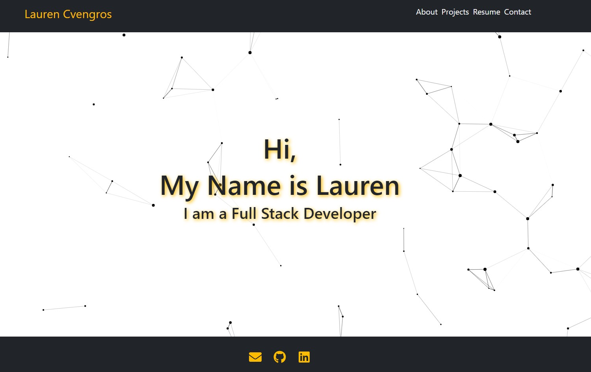

## React Portfolio


Deployed Application:


## Table-of-Contents

1. [Description](#description)

2. [User Story](#user-story)

3. [Installation](#installation)

4. [Usage](#usage)

5. [Technologies](#technologies)

6. [Contact Me](#contact-me)


## Description

An updated portfolio created with React to demonstarte my skills as a full stack web developer.

Screenshot of the Application



## User Story 

```md
AS AN employer looking for candidates with experience building single-page applications
I WANT to view a potential employee's deployed React portfolio of work samples
SO THAT I can assess whether they're a good candidate for an open position
```

## Installation

* If you like the design of my portfolio, you may clone the repository here using git clone and npm install to use the npm packages.


https://github.com/Laurencvengros/React_Portfolio

* Please give credit if you choose to do so.

* If you would like to run the appliaction locally, use npm start and open in the browser using http://localhost:3000


## Contact Me

This Application was created by me, Lauren Cvengros.

For questions/comments/concerns please contact me via the information below

* Author: Lauren Cvengros
* Email: L.Cvengros@icloud.com
* github: Laurencvengros -> https://github.com/Laurencvengros